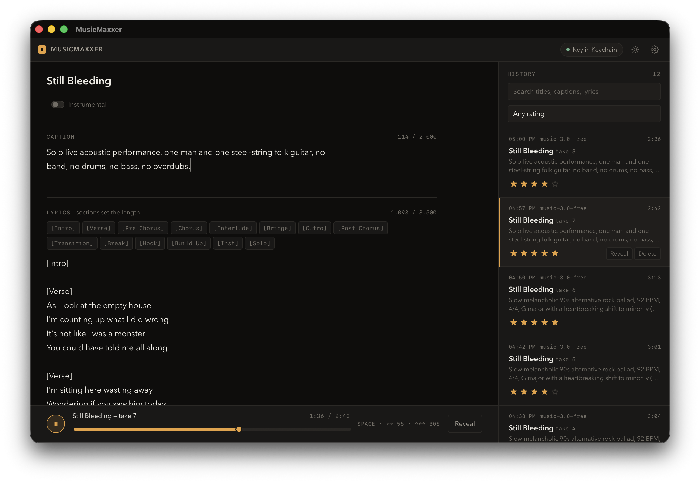

# MusicMaxxer

A local macOS desktop app for generating songs through [MiniMax](https://www.minimax.io/)'s
hosted Music API. Single user, single machine, no server component — every
generation is a direct call from your own machine to MiniMax's API, and
everything it produces is written straight to a plain-folder library on your
disk that you own and can read without the app.



## What it does

- **Compose a song** from a caption (genre, tempo, mood, vocal character,
  production) and a lyric sheet with structure tags — `[Verse]`, `[Chorus]`,
  `[Bridge]`, and eleven others MiniMax recognises.
- **Live lint on the lyrics field.** MiniMax sings anything in brackets that
  isn't one of its fourteen exact structure tags — including near-misses like
  `[Verse 1]` — with no error and no warning from the API itself. MusicMaxxer
  catches this before you spend a generation: it flags the line, suggests the
  tag you probably meant, and asks for confirmation if you generate anyway.
- **A real library on disk**, one folder per song: an editable `song.md`
  recipe (drag it back onto the window to restore every field), an immutable
  `run.json` receipt per take, and a `meta.json` star rating. Nothing here is
  a database — it's just files, readable and greppable without the app.
- **History with inline playback.** Every take is listed, star-rated 1–5,
  filterable by rating and free text, and playable with a seek slider right
  in the app. Clicking a take reloads *that take's own* settings — pulled
  from its immutable receipt, not from the song's shared recipe — back into
  the compose form, so you can pick up where a specific generation left off.
- **Dark mode** — System / Light / Dark, plus a one-click toggle in the
  titlebar.
- **The API key never leaves Rust.** It's typed once into Settings, stored in
  the macOS Keychain, and no command ever hands it back to the webview. The
  frontend cannot reach the network or the filesystem directly — every
  effect, including audio playback, is routed through a Tauri command.

## Requirements

- macOS (Apple Silicon or Intel)
- [Rust](https://rustup.rs/) (stable toolchain)
- [Node.js](https://nodejs.org/) 18+
- A [MiniMax](https://www.minimax.io/) account with music API access and an
  API key (paid models, and the `-free` tier, both require a funded account —
  see `SPEC.md` §3.5 for what was actually observed here)

## Getting started

```bash
git clone https://github.com/dexterlagan/MusicMaxxer.git
cd MusicMaxxer
npm install
```

Run in development mode, with hot reload:

```bash
npm run tauri dev
```

Or build a release `.app` bundle:

```bash
npm run app:build       # builds target/release/bundle/macos/MusicMaxxer.app
npm run app             # opens the built bundle
npm run app:install     # copies it to /Applications
```

On first launch, open Settings (the gear icon) and paste in your MiniMax API
key. It's written to the Keychain immediately and never stored anywhere else.

## Where things live

Generated songs are written to `~/MiniMaxMusic` by default — one folder per
song, one subfolder per take:

```
~/MiniMaxMusic/
  some-song-title/
    song.md          the recipe: caption, lyrics, and settings — hand-editable,
                      rewritten on every generate to match the newest take
    song.json         machine bookkeeping (take numbering), ignore this
    take-01/
      track.wav
      run.json        the immutable receipt for this exact take
      meta.json        star rating, only written once you rate it
    take-02/
      ...
```

Drag a `song.md` onto the app window to restore every field of the form it
came from — title, caption, lyrics, and flags.

## Project structure

```
crates/
  minimax/     API client — typed requests, response parsing, error mapping,
               and client-side validation, independently testable against
               recorded fixtures (no Tauri, no filesystem, no UI)
  studio/      app logic — credentials (OS keychain), the on-disk library
               layout, the song.md recipe format, lyric structure-tag linting
src-tauri/     the Tauri shell — the only place that touches the network,
               the filesystem, or the API key; every command is the sole
               bridge between the webview and everything else
ui/            the compose/history frontend — vanilla TypeScript, no
               framework, talks to Rust exclusively through invoke()
design/        the original clickable HTML mockup used to validate the UI
               before any of it was built
SPEC.md        the build contract — API behaviour (including everything
               observed that contradicts MiniMax's own docs), the on-disk
               format, and the UI spec section by section
```

`SPEC.md` is the source of truth for *why* things are built the way they are
— it records real observed API behaviour (undocumented duration drivers, the
bracket-singing failure mode, wall-clock timing that doesn't track output
length) rather than assumptions, and flags anywhere the docs and reality
disagreed.

## Status

Every generation currently uses a fixed model (`music-3.0-free`) and output
format (wav, 44.1 kHz) — a settings panel for model tier, format, and library
location is the next planned step. The Cover tab (remixing a reference track)
and an optional offline/online lyric-assistant pass are designed in the spec
but not yet built.

## License

MIT
